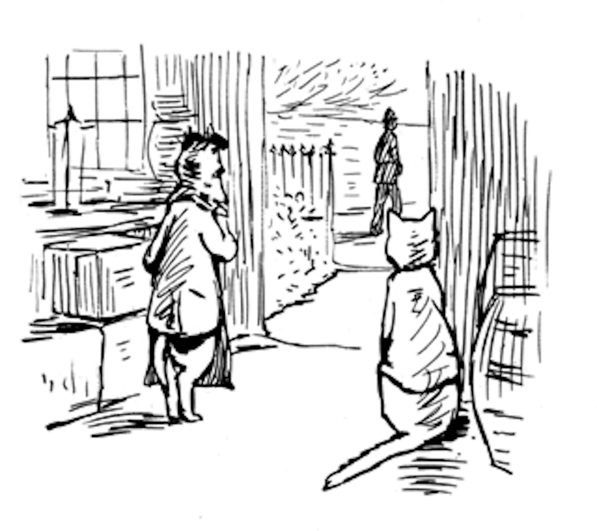

##When it came to Jan. 1st there was still no money, and Pickles was unable to buy a dog licence.

##"It is very unpleasant, I am afraid of the police," said Pickles.

##"It is your own fault for being a terrier; I do not require a licence, and neither does Kep, the Collie dog."

##"It is very uncomfortable, I am afraid I shall be summoned. I have tried in vain to get a licence upon credit at the Post Office;" said Pickles. "The place is full of policemen. I met one as I was coming home."

##"Let us send in the bill again to Samuel Whiskers, Ginger, he owes 22/9 for bacon."

##"I do not believe that he intends to pay at all," replied Ginger.