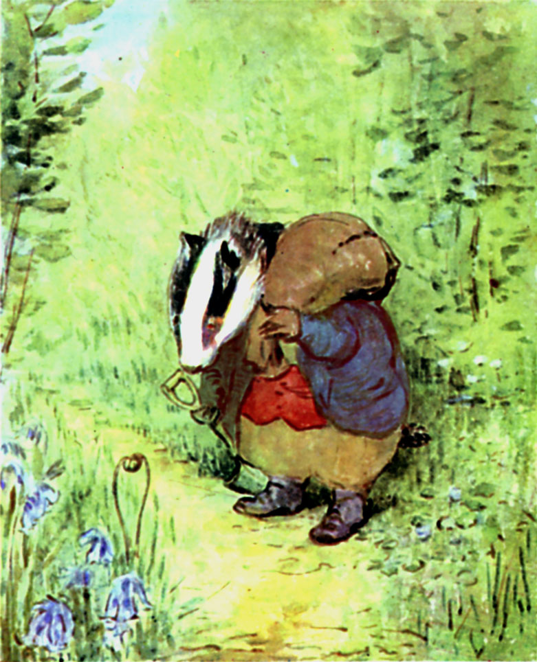

There was not much difficulty in tracking Geir "Gliser'n" Grevling; he had left his foot-mark and gone slowly up the winding footpath through the wood. Here he had rooted up the moss and wood sorrel. There he had dug quite a deep hole for dog darnel; and had set a mole trap. A little stream crossed the way. Benjamin skipped lightly over dry-foot; the grevlingens heavy steps showed plainly in the mud.

