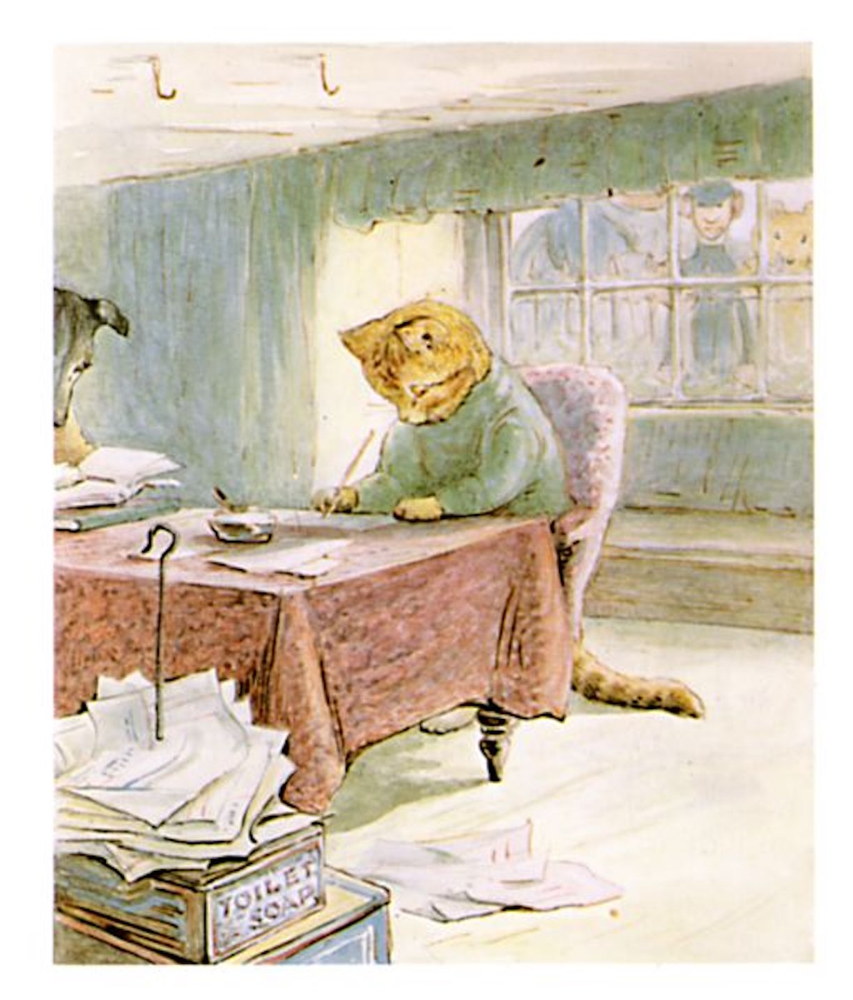

##Ginger and Pickles retired into the back parlour.

##They did accounts. They added up sums and sums, and sums.

##"Samuel Whiskers has run up a bill as long as his tail; he has had an ounce and three-quarters of snuff since October."

##"What is seven pounds of butter at 1/3, and a stick of sealing wax and four matches?"

##"Send in all the bills again to everybody 'with compts,'" replied Ginger.
