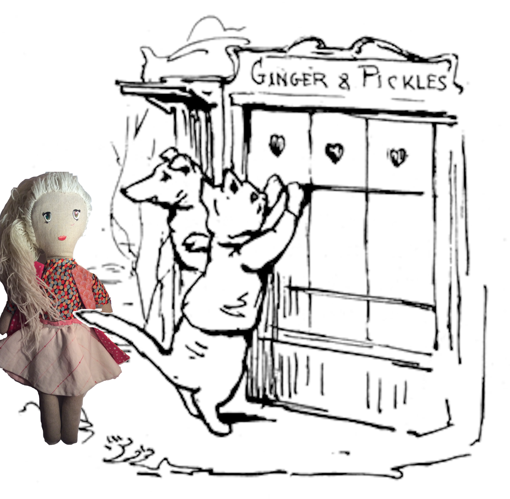

##De satte opp plater med små hjertehull foran vinduene så de kunne dra fra butikken for å skaffe pengene. Plutselig sto en av kundene bak dem.

##Eh... beklager frøken Elsa, vi er stengt. Jeg er redd jeg ikke kan hjelpe deg. Sa Pikcles

##Det er grunnen til at jeg er her, for å hjelpe dere. Jeg kjenner en fyr som har en jobb til dere. Han betaler godt for bra arbeid hvis dere ikke forteller noen, det er hemmelig.

##They put up the shutters in front of the windows to leave the store to find the money. But suddenly one of the costumers stood behind them.

##Eh... Sorry miss Elsa, we are closed. I am afraid I cannot help you today, or maybe any other day, in fact. We shall have to see. Said Pickles

##Well that is why I am here, to help you. I know someone who needs a job done. He pays well for quality work done discreetly. Please follow me. Elsa started walking.

