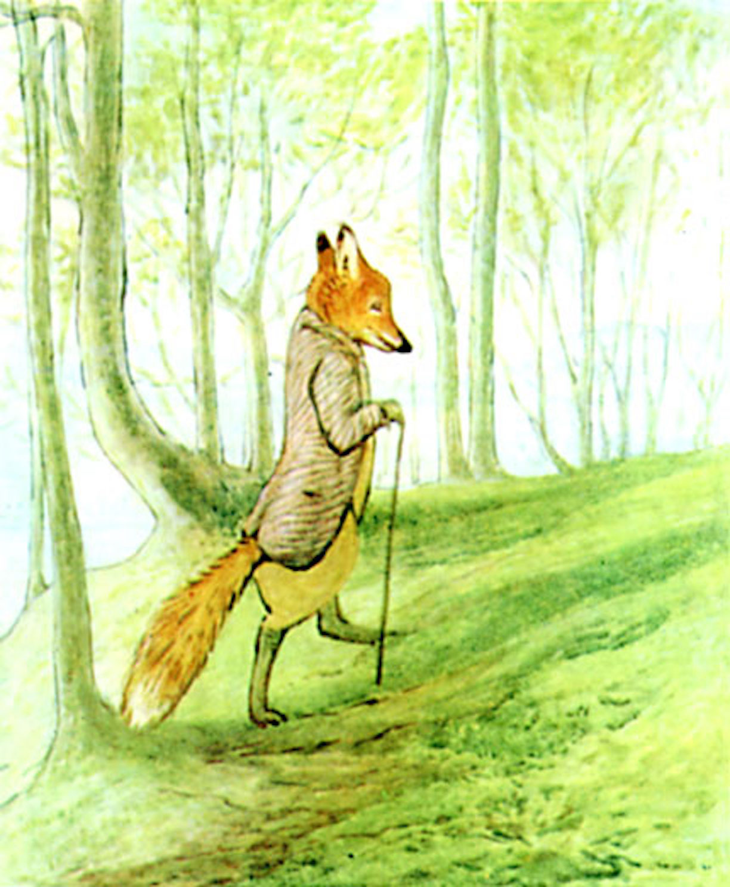
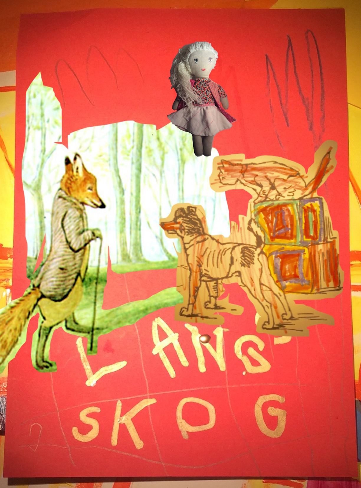

##Mr. Tod slapped his stick upon the earth and fumed; he  was  annoyed by the crow which followed him persistently. It flew from tree to tree and scolded, warning every rabbit within hearing that a fox was coming through the neighbourhood. The crow flew cawing over his head, Mr. Tod snapped at it, and barked.

##Pardon me Mr. Tod, I would like to introduce you to the former shop owners Ginger & Pickles. Ginger, a yellow cat. Pickles a Boston Terrier.

##Ah! How nice to meet you! Thank you miss Elsa, you may stay also. As Elsa might have mentioned I have a job for you.

##Yes mr Todd, said Ginger

##I've almost nothing to offer but blood, toil, tears and sweat. You have before you an ordeal of the most grievous kind. You have before you many, many long days of struggle and of suffering.

##Almost? Said Pickles.

Norwegian translation

blodslit, tårer og svette.

ildprøve