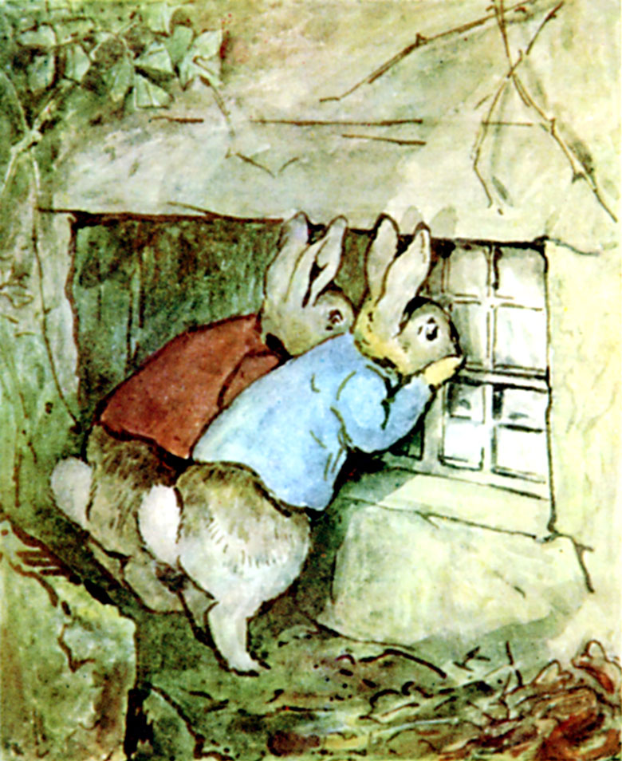

They crept up to the bedroom window. It was closed and bolted like the kitchen. But there were signs that this window had been recently open; the cobwebs were disturbed, and there were fresh dirty footmarks upon the window-sill.

The room inside was so dark, that at first they could make out nothing; but they could hear a noise—a slow deep regular snoring grunt. And as their eyes became accustomed to the darkness, they perceived that somebody was asleep on Mr. Tod's bed, curled up under the blanket.—"He has gone to bed in his boots," whispered Peter.

"Let's hope he doesn't wake up anytime soon." Said Peter.

