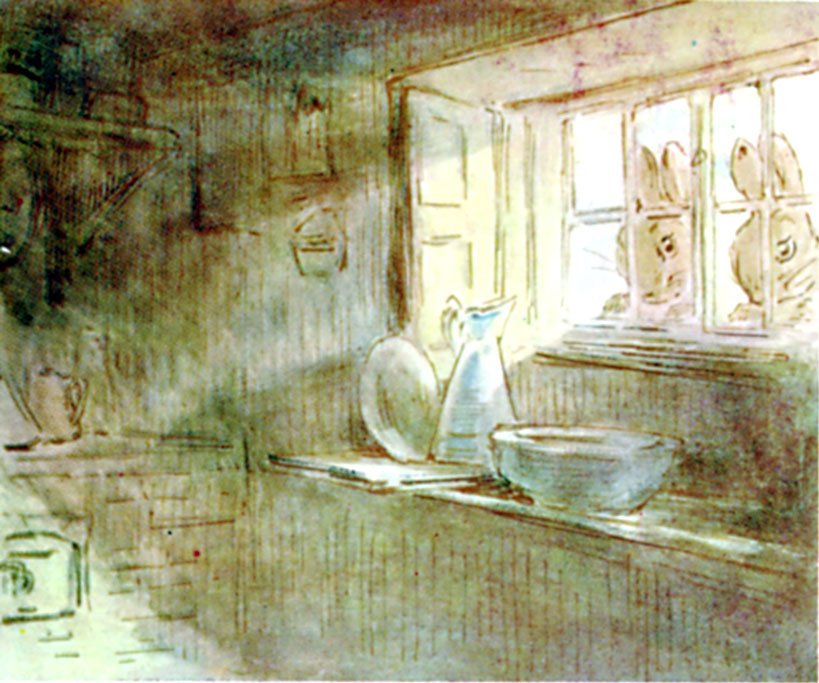

Så sa Lillian "Jeg knuser vinduet med sjørøversverdet mitt."

Klirr!

Så åpnet Lillian vinduet og Benjamin hoppet inn. Benjamin åpnet den lille jerndøra og følte inni. Der rørte seg noe varmt og mykt. Alle tre samarbeidet med å løfte sekken forsiktig ned på kjøkkengulvet.

"Hei! Skjærene bråker veldig der nede i skogen..."

Fire ører sto rett opp og de to kaninene så stivt på hverandre.

<!--
and that the jays were making a noise down below in the woods.

Benjamin Bunny came out of the dark tunnel, shaking the sand from his ears; he cleaned his face with his paws. Every minute the sun shone warmer on the top of the hill. In the valley there was a sea of white mist, with golden tops of trees showing through.

Again from the fields down below in the mist there came the angry cry of a jay—followed by the sharp yelping bark of a fox!

-->

Igjen hørtes kjeftinga fra Skjærene nede i skogen og et skarpt revebjeff.