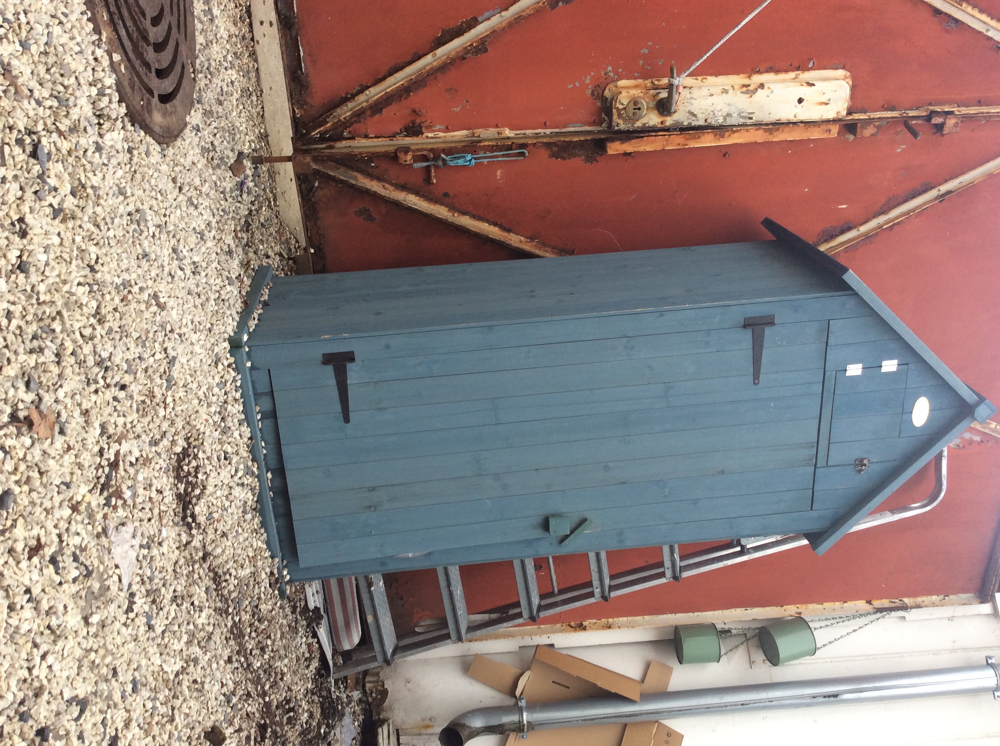
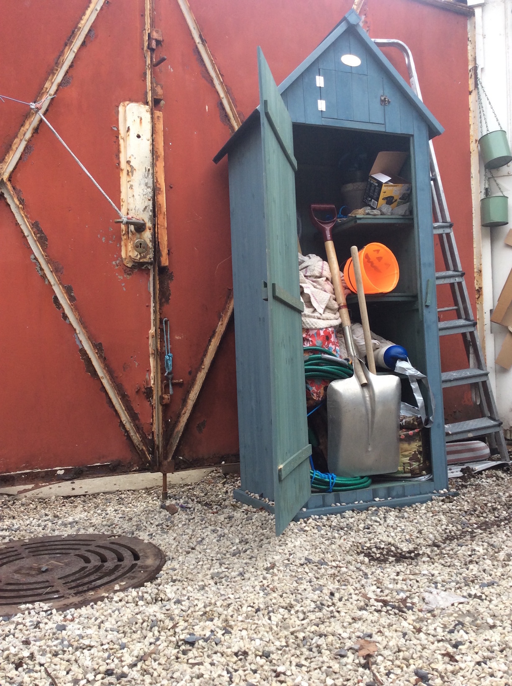

##The secret tunell is under the floor of this tool shed. Climb down the stairs and you will come out into the light of day down by the docks without anybody seeing you. Right beside the ship of Captain Carrot. Captain Carrot is capable and resourceful. He will get you and the cargo down river to London. He knows where to find my contact the seamstress working at the Globe theater.

##Oh! You might have to clean it out first. Miss Elsa, will you make sure Ginger & Pickles meet up with Captain Carrot there's a good girl. Cherioo!

