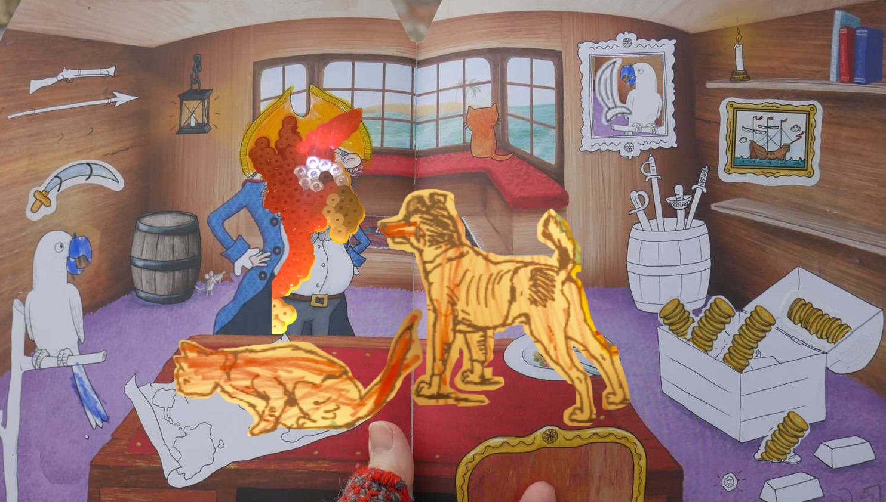

##Captain Carrot's ship

##Arrh! Pickles, Pickles, Pickles. I knew your cunning father! You should have seen him! He never gave up, like a, like a terrier, well. He told me to keep this for you.

##Here, look at it. Your father's air rifle. Top quality! I have never seen it's egual, not even close. It is almost noise less. Just a small pop. Yes take it down, says Captain Carrot.

##Just bend it, like that yes. Here is a pellet.

##I'll pop open the window for you. Try a shot. An elegant weapon for a ... Never mind, you might need it where we are going. Yeah that is London you see on the riverside. I guess you didn't dream it would look like that, eh! He he! This is the year 1599 and you will never find a more wretched hive of scum and villainy than that part of the south bank of the River Thames, around the Globe theatre. We will se the Globe theatre right around the bend.

##mørkt, drar avsted

