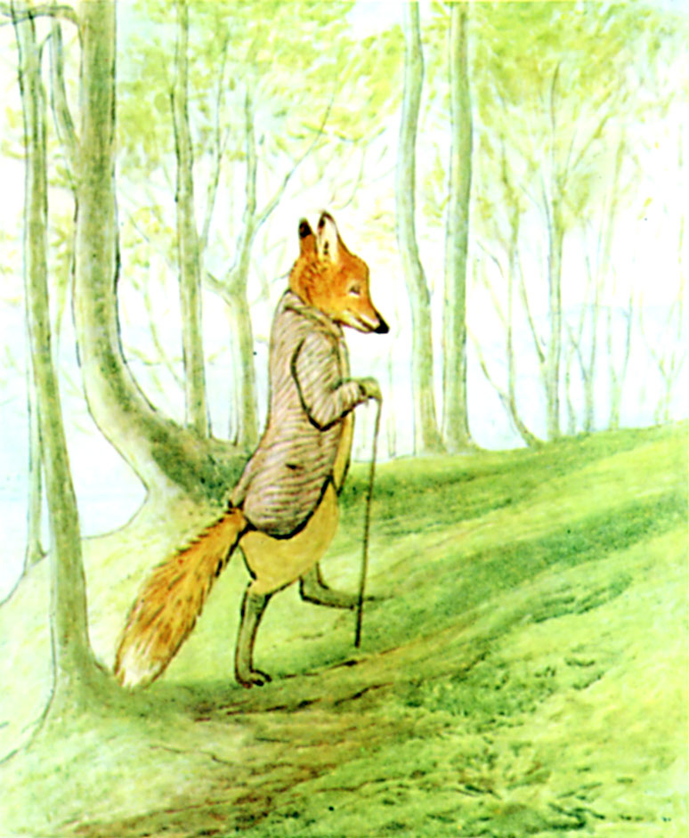

Mr. Tod slapped his stick upon the earth and fumed; he guessed where Tommy Brock had gone to. He was further annoyed by the jay bird which followed him persistently. It flew from tree to tree and scolded, warning every rabbit within hearing that either a cat or a fox was coming up the plantation. Once when it flew screaming over his head—Mr. Tod snapped at it, and barked.

He approached his house very carefully, with a large rusty key. He sniffed and his whiskers bristled. The house was locked up, but Mr. Tod had his doubts whether it was empty. He turned the rusty key in the lock; the rabbits below the bed could hear it. Mr. Tod opened the door cautiously and went in.