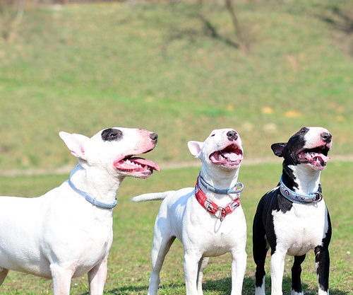

##Bang! Dørene slår opp og inn kommer 3 bull terrierere.

##Yo! RisteBjørn! Jeg vil ha pengene i dag! Sier GEir, den midterste bull terrierern.

##Eh...sier RisteBjørn Jeg har ikke penger på meg, dere må vente til i morgen etter forestillingen. Det er ...

##Ja-ja-ja! Samma for vårs hvilken forestilling. Tror du menneskene har lyst til å sitte her i Bygget kan jo dette ned. Og se der kanonkulehull. Det blir nok bare dyr som kommer i morgen, og dyr kjøper billigste billett alle sammen. Så dere får gi meg kostymene, de kan sjefen selge...

##Pickles stiller seg ved siden av RisteBjørn mens Geir fortsetter å snakke. Tar fra RisteBjørn wombat geværet og åpner det. Drar ut granaten med tenna,  setter inn en gummikule, sikter på magen til Geir og skyter.

##Blurp! Auch!

##Geir ligger på bakken og klarer ikke å snakke, han klarer såvidt å puste.

##Pickles putter inn igjen granaten han har mellom tenna, sikter på den ene kompisen til Geir.

##Hva? Spør Pickles med høflig tone, mens han ser på Geir. Du var midt i en spennenede historie om kostymer og sjefen din.

##Nei? Hvis ikke DU fortsetter fortellingen, så får jeg fortelle resten. Sjefen din kan komme om en uke og få pengene sine. Da skal han først se hele den nye forestillingen Romeo Og Elsa PiratPrinsessen som vi setter opp for første gang den dagen. Romeo Og Elsa er årets mest ... teaterstykke og ingen forventer at det skal settes opp allerede om en uka. Menneskene kommer til å fylle opp de dyre plassene sine og dyra kommer til å stå i kø utenfor etter at det er fullt.

<!-- http://flickriver.com/groups/2622623@N24/pool/random/ -->