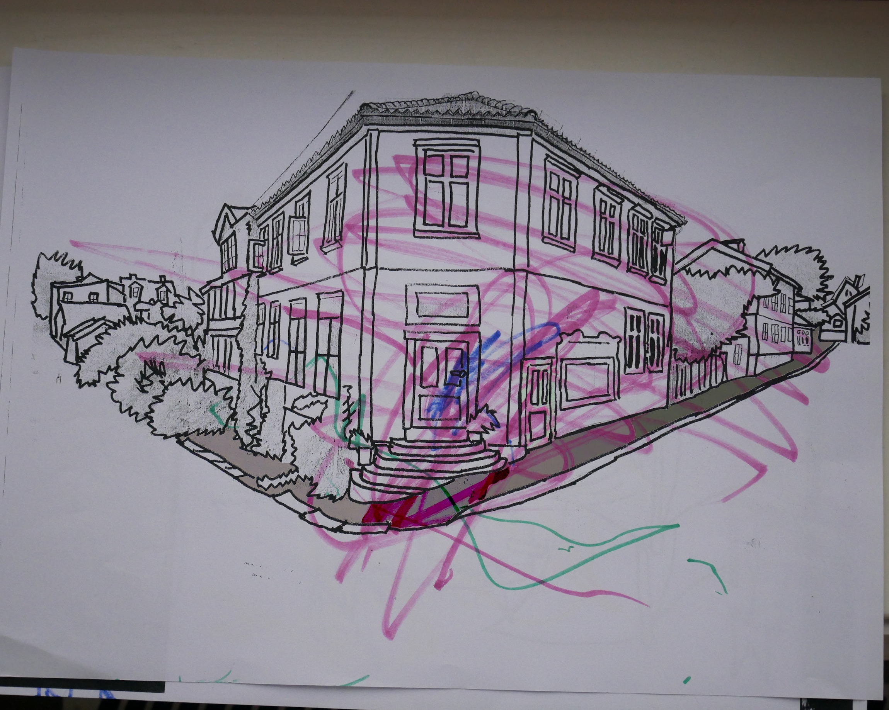
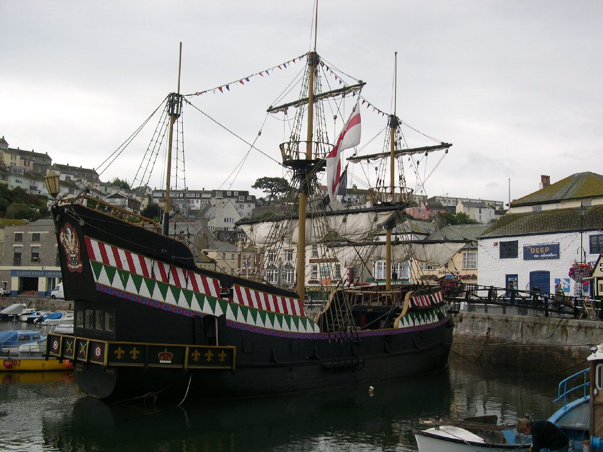

##Sjefen deres kommer til å fortelle alle menneskevennen sine at Romeo Og Elsa settes opp om en uke. Han elsker å vite ting først, så nå MÅ vi sette det opp selve scriptet ikke er halvferdig engang. Sa Ginger

##Vi trenger hjelp av Sir Francis Drake. Sa Ginger

##Sir Francis Drake! Hvor bor han? SA Pickles?

##Han bor rett nedi gata her. Så han er nærme elva og kan passe på skuta si.

##Ok da drar vi dit!

##De banker på døra, og får beskjed om å banke på den lille døra. Fordi de er dyr ikke mennesker.

##kommer inn og møter Sir Francis Drake

##Jepp vi drar ned på skuta mi og lager en plan! Sier Drake

<!-- 13 Break into 3 -->

##Når Romeo & Elsa settes opp sørger vi for at gull-juli får biletter. mens hun ser på teater sniker vi oss ombord og henter granatene!

##Ok sier Sir Francis Drake. Jeg er med :D

<!-- https://upload.wikimedia.org/wikipedia/commons/6/64/Goldenhindatbrixham.JPG -->