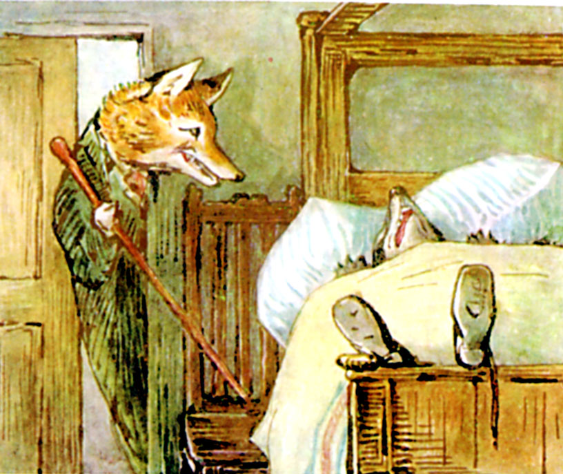

For the next twenty minutes Mr. Tod kept creeping cautiously into the house, and retreating hurriedly out again. By degrees he ventured further in—right into the bedroom. When he was outside the house, he scratched up the earth with fury. But when he was inside—he did not like the look of Tommy Brock's teeth.

He was lying on his back with his mouth open, grinning from ear to ear. He snored peacefully and regularly; but one eye was not perfectly shut.

Mr. Tod came in and out of the bedroom. Twice he brought in his walking-stick, and once he brought in the coal-scuttle. But he thought better of it, and took them away.

When he came back after removing the coal-scuttle, Tommy Brock was lying a little more sideways; but he seemed even sounder asleep. He was an incurably indolent person; he was not in the least afraid of Mr. Tod; he was simply too lazy and comfortable to move.