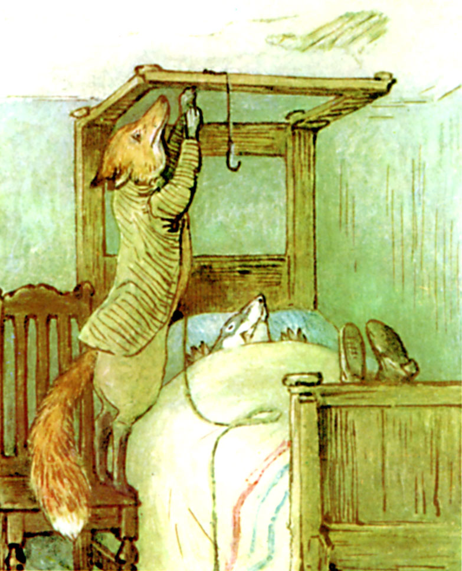

Mr. Tod fetched a large heavy pailful of water from the spring, and staggered with it through the kitchen into his bedroom.

Tommy Brock snored industriously, with rather a snort.

Mr. Tod put down the pail beside the bed, took up the end of rope with the hook—hesitated, and looked at Tommy Brock. The snores were almost apoplectic; but the grin was not quite so big.

Mr. Tod gingerly mounted a chair by the head of the bedstead. His legs were dangerously near to Tommy Brock's teeth.

He reached up and put the end of rope, with the hook, over the head of the tester bed, where the curtains ought to hang.

(Mr. Tod's curtains were folded up, and put away, owing to the house being unoccupied. So was the counterpane. Tommy Brock was covered with a blanket only.) Mr. Tod standing on the unsteady chair looked down upon him attentively; he really was a first prize sound sleeper!

