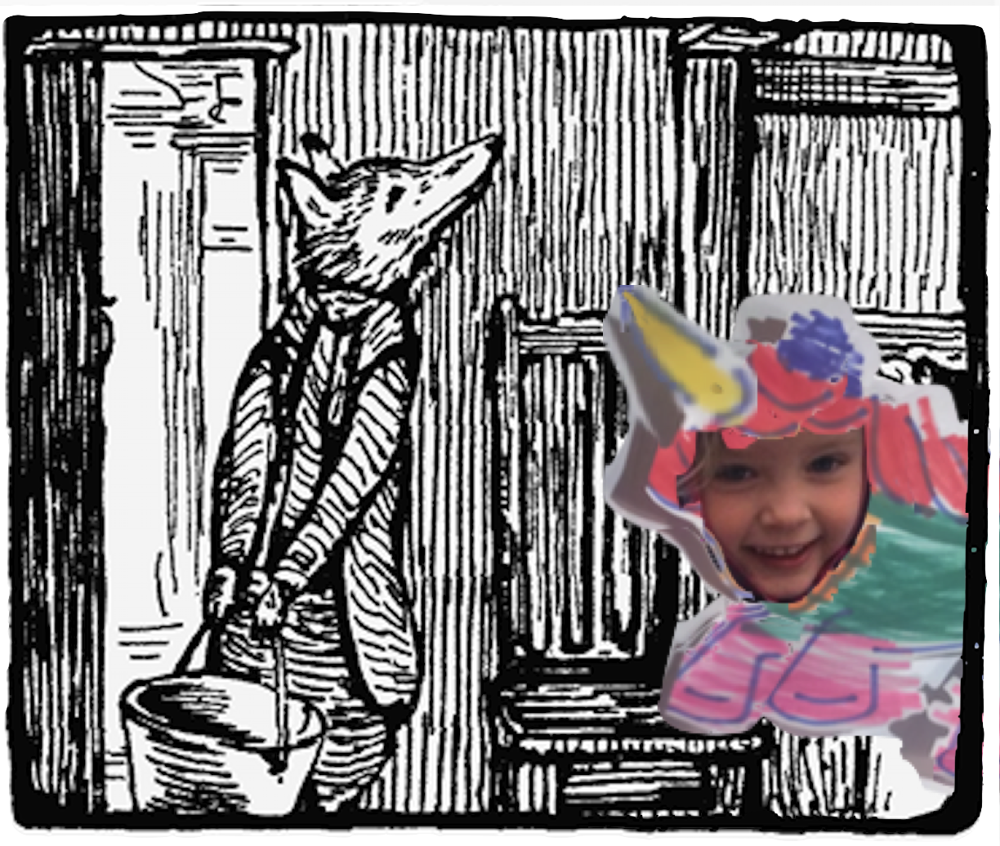

Mr. Tod descended safely from the chair, and endeavoured to get up again with the pail of water. He intended to hang it from the hook, dangling over the head of Tommy Brock, in order to make a sort of shower-bath, worked by a string, through the window.

But naturally being a thin-legged person (though vindictive and sandy whiskered)—he was quite unable to lift the heavy weight to the level of the hook and rope. He very nearly overbalanced himself.

Lillian krøyp ut fra senga og sa "Jeg kan hjelpe deg å løfte."

"Åh, hei du søte lille enhjørning! Ja hjelp meg gjerne."

The snores became more and more apoplectic. One of Tommy Brock's hind legs twitched under the blanket, but still he slept on peacefully.

<!-- Mr. Tod and the pail descended from the chair without accident. After considerable thought, he emptied the water into a wash-basin and jug. The empty pail was not too heavy for him; he slung it up wobbling over the head of Tommy Brock.

Surely there never was such a sleeper! Mr. Tod got up and down, down and up on the chair.

As he could not lift the whole pailful of water at once, he fetched a milk jug, and ladled quarts of water into the pail by degrees. The pail got fuller and fuller, and swung like a pendulum. Occasionally a drop splashed over; but still Tommy Brock snored regularly and never moved,—except one eye. -->