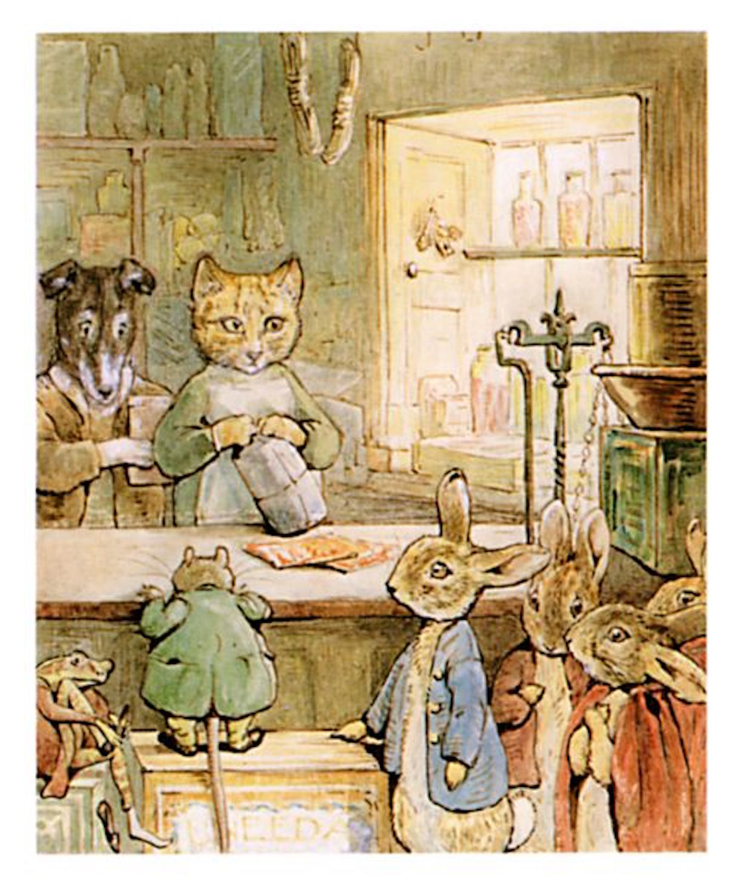

##The counter inside was a convenient height for rabbits. Ginger and Pickles sold red spotty pocket-handkerchiefs at a penny three farthings.

##They also sold sugar, and snuff and galoshes.

##In fact, although it was such a small shop it sold nearly everything—except a few things that you want in a hurry—like bootlaces, hair-pins and mutton chops.

##Ginger and Pickles were the people who kept the shop. Ginger was a yellow tom-cat, and Pickles was a terrier.

##The rabbits were always a little bit afraid of Pickles.

